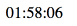

# react-countdown-moment

> [React](https://facebook.github.io/react/) countdown timer text using [momentjs](https://github.com/moment/moment/).



# Demo

[https://lab.miguelmota.com/react-countdown-moment](https://lab.miguelmota.com/react-countdown-moment)

# Install

```bash
npm install react-countdown-moment
```

# Usage

```javascript
import React from 'react'
import ReactDOM from 'react-dom'
import moment from 'moment'
import Countdown from 'react-countdown-moment'

const endDate = moment().add(2, 'hours')

ReactDOM.render(
  <Countdown endDate={endDate} />,
  document.getElementById('root')
)
```

# License

MIT
